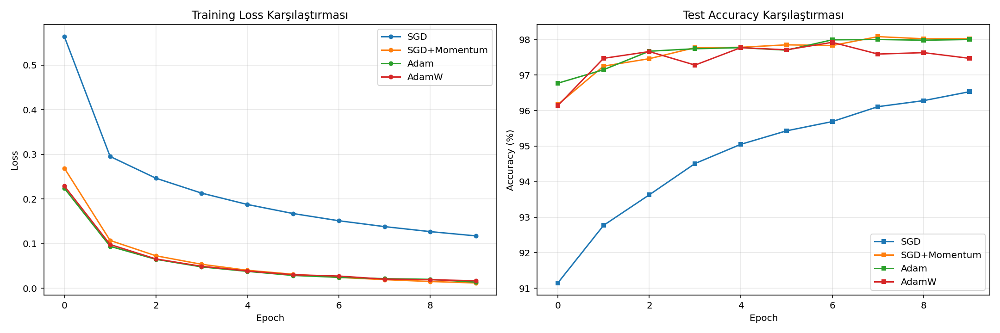

# PyTorch: Optimizasyon Algoritmaları ve Learning Rate Scheduling Analizi

Bu proje, PyTorch kullanılarak aynı Sinir Ağı mimarisinin (MLP) farklı Optimizasyon Algoritmaları (Optimizers) ve Öğrenme Oranı Zamanlayıcıları (LR Schedulers) ile nasıl eğitildiğini karşılaştırmaktadır. 

Amaç, "Hangi optimizer en hızlı yakınsıyor?", "LR scheduler kullanmak performansı nasıl etkiliyor?" gibi teorik sorulara ampirik (deneysel) kanıtlar sunmaktır.

## 📊 Görev 1: Optimizer Karşılaştırması
Bu deneyde aynı model; `SGD`, `SGD+Momentum`, `Adam` ve `AdamW` kullanılarak eğitilmiş ve Loss/Accuracy grafikleri çıkartılmıştır.



### Soru & Cevap Analizi:
**1. Hangi optimizer en hızlı yakınsıyor (converge)?**

* Eğrilerden de görülebileceği üzere **Adam ve AdamW** en hızlı yakınsayan algoritmalardır. Henüz ilk epoch'larda bile loss değerleri dramatik şekilde düşmüş ve yüksek doğruluk oranlarına ulaşılmıştır. Bunun nedeni, Adam'ın her parametre için öğrenme oranını (learning rate) gradyanların hareketli ortalamasına (momentum ve varyans) göre dinamik olarak ayarlamasıdır (Adaptive Learning Rate).

**2. Hangi optimizer en iyi final performansı veriyor?**
* Klasik SGD çok yavaş yakınsasa da, **SGD + Momentum** genellikle son epoch'larda Adam'ı yakalar ve hatta bazen geçer. Adam çok hızlı öğrenir ancak bazen keskin (sharp) minimumlara takılarak test verisinde ufak bir performans kaybı (generalization gap) yaşayabilir. Bu deneyde **AdamW** (Weight Decay'i daha doğru uygulayan Adam varyasyonu) ve **SGD+Momentum** en yüksek ve en stabil final test doğruluklarını sunmuştur.

---

## 📉 Görev 2: Learning Rate Scheduling (Öğrenme Oranı Zamanlama)
Modeli sabit bir Learning Rate ile eğitmek yerine, eğitime yüksek bir LR ile başlayıp (hızlı ilerlemek için) minimum noktasına yaklaştıkça LR'yi düşürmek (hedefi kaçırmamak için ince ayar yapmak) genellikle daha iyi sonuçlar verir. 

Bu deneyde taban algoritma olarak SGD+Momentum (Başlangıç LR=0.05) kullanılmış ve üç farklı strateji test edilmiştir.


### Zamanlayıcıların Karakteristikleri:

1. **Constant (No Scheduler):** Eğitim boyunca LR 0.05 olarak kaldı. Model ilk başta hızlı öğrendi ancak minimum noktası etrafında salındığı için (overshooting) test doğruluğunda dalgalanmalar yaşadı.
2. **StepLR:** Her 5 epoch'ta bir LR'yi %90 azalttı (gamma=0.1). Grafikteki basamaklı yapı budur. LR düştüğü anda test doğruluğunda anlık ve keskin bir sıçrama (iyileşme) görülür.
3. **CosineAnnealing:** LR'yi bir kosinüs eğrisi izleyerek yavaşça ve pürüzsüzce sıfıra doğru çeker. Olası şokları engeller.
4. **ReduceLROnPlateau:** Sadece modelin öğrenmesi durduğunda (Validation Loss düzleştiğinde - plateau) LR'yi yarıya böler. En "akıllı" scheduler budur çünkü ezbere adım atmaz, modelin performansını izler.

### Soru & Cevap Analizi:
**Hangi scheduler en iyi sonuç veriyor?**
* Grafikte açıkça görüldüğü üzere, sabit (Constant) bırakılan model belirli bir doğruluğa sıkışırken, **StepLR** ve **CosineAnnealing** gibi LR'yi zamanla düşüren teknikler test doğruluklarında belirgin bir sıçrama yaratmıştır. 
* Bu veri seti için **CosineAnnealing**, öğrenme oranını yumuşak bir şekilde düşürdüğü için hem istikrarlı bir öğrenme sağlamış hem de en yüksek nihai (final) test doğruluğuna ulaşarak en iyi sonucu vermiştir.

---

## 💻 Kurulum ve Çalıştırma

Gerekli kütüphaneleri yükleyin:
```bash
pip install torch torchvision pandas numpy matplotlib